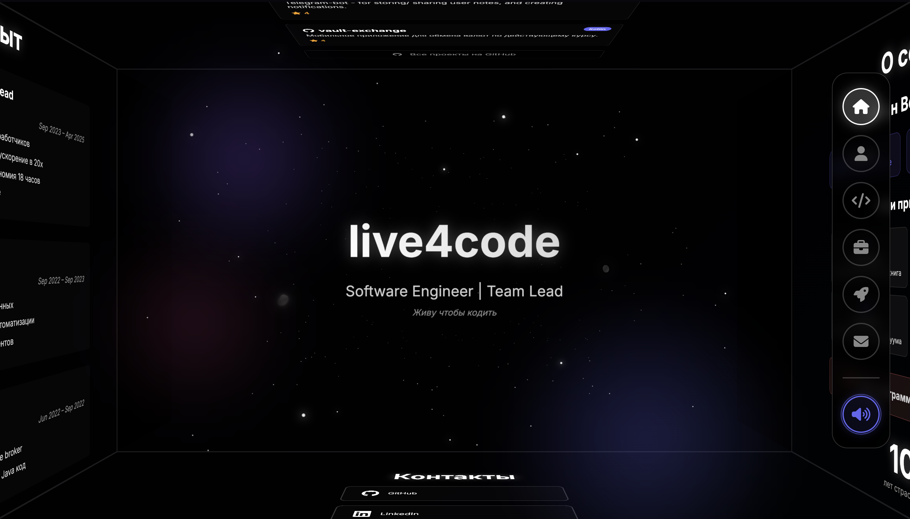

# Rapport de Stage Interactif

[Visiter le site](https://l1ve4code.github.io/live4code/)

Un rapport de stage interactif innovant qui présente l'expérience professionnelle de Thomas Bidault en tant que Chef de Projet Digital, avec une expérience utilisateur moderne et immersive.



## 🚀 Caractéristiques

### Expérience Interactive
- **Cube 3D Rotatif**: Navigation intuitive à travers les différentes sections (Expérience, Compétences, À propos)
- **Version Mobile Optimisée**: Interface de slider fluide pour une meilleure expérience sur mobile
- **Animations Fluides**: Transitions douces entre les sections
- **Design Moderne**: Interface utilisateur soignée avec effets visuels subtils

### Sections Principales
1. **Accueil** - Présentation interactive avec animation de texte
2. **Expérience** - Détails professionnels et missions concrètes
3. **Compétences** - Cartes interactives avec descriptions détaillées
4. **À propos** - Informations personnelles et parcours académique

### Fonctionnalités Techniques
- **Responsive Design**: Interface adaptée à tous les écrans
- **Navigation Intuitive**: Contrôles simples et efficaces
- **Performances Optimisées**: Chargement rapide et animations fluides
- **Accessibilité**: Navigation facile sur mobile et ordinateur

## 🛠️ Technologies Utilisées

- **Frontend**: Vanilla JavaScript (ES6+), HTML5, CSS3
- **Animations**: CSS3 Transforms et animations
- **Design**: Responsive design avec approche mobile-first
- **Performance**: Optimisation des ressources et gestion mémoire

## 📁 Structure du Projet

```
live4code/
├── index.html          # Fichier HTML principal
├── script.js           # Logique JavaScript
├── styles.css          # Styles et animations
├── sounds/             # Fichiers audio
│   ├── background.mp3  # Musique d'ambiance
│   └── click.mp3       # Effets de clic
├── favicon/            # Fichiers favicon
│   ├── favicon.ico
│   ├── favicon-16x16.png
│   ├── favicon-32x32.png
│   └── favicon-256x256.png
└── README.md
```

## 🚀 Démarrage

### Prérequis
- Navigateur moderne avec JavaScript activé
- Serveur web local (pour certaines fonctionnalités)

## 🎮 Navigation

### Contrôles Ordinateur
- **Clic de Souris**: Cliquez sur les faces visibles du cube pour naviguer
- **Boutons de Navigation**: Utilisez le panneau de navigation à droite

### Contrôles Mobile
- **Glisser**: Gestes horizontaux pour naviguer entre les sections
- **Toucher**: Boutons de navigation tactiles pour accéder directement aux sections

## 🎨 Personnalisation

### Modification du Contenu
- **Informations Personnelles**: Mettre à jour les détails de contact
- **Compétences**: Modifier les catégories de compétences et les descriptions
- **Expérience**: Mettre à jour le parcours professionnel et les missions

### Style
- **Couleurs**: Thème moderne avec variables CSS personnalisables
- **Animations**: Timing et fonctions d'animation ajustables
- **Layout**: Points de rupture responsives pour différentes tailles d'écran

## 📱 Support des Navigateurs

- **Chrome**: Support complet (recommandé)
- **Firefox**: Support complet
- **Safari**: Support complet avec avertissement pour les utilisateurs
- **Edge**: Support complet
- **Navigateurs Mobiles**: Interface optimisée pour le touch

**Thomas Bidault**
- GitHub: [MrFrosas](https://github.com/MrFrosas)
- Email: thomas.bidault@ccsglobal.fr
